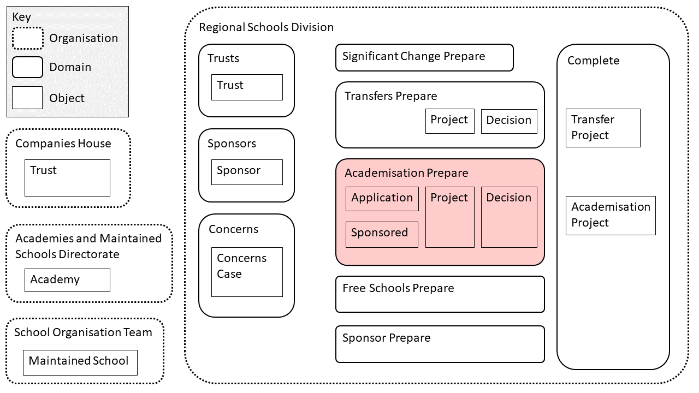
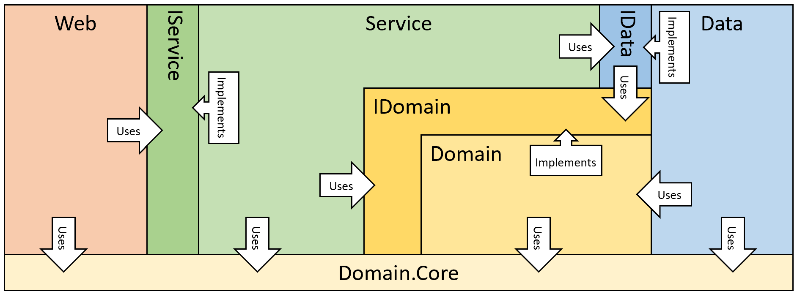

# academisation api
This is the API for persisted data related to academisation:

* Applications to Become an Academy
* Conversion Projects
* Advisory Board Decisions on Conversions

## Context

This API is intended to own the business logic and 
store data related to Preparing for Academisation: the process by which a Maintained School becomes an Academy. This fits within the responsibilities owned by the Regional Services Division:



## Architecture
The architecture of this solution is based on:
* Domain Driven Design
* Hexagon Architecture

The key aspiration of this architecture is to remove any references to technical frameworks (database implementations, web interfaces) from the Domain Layer, so that this layer can focus on the pure logic.  

The following diagram shows the relationship between the projects in the solution:



Each of the layers in this architecture has a distinct set of responsibilities:

| Layer   | Responsibility |
|---------|----------------|
| Web     | Mapping to HTTP |
| Service | Co-ordination of a complete operation |
| Domain  | Validation and Mutation |
| Data    | Persistence |

## Development Setup

### Authentication

When running locally the webapp does not require authentication.  Once deployed the
authentication keys should be provided as a configuration setting.  For best practice
this key should be provided as a UUID:

```
"AuthenticationConfig__ApiKeys__0" -> "<Key>"
"AuthenticationConfig__ApiKeys__1" -> "<Key>"
```

### EntityFramework and Migrations

Set your database connection string in user secrets:

"AcademiesDatabaseConnectionString": "connection string here"

Install the Entity Framework Core CLI Tools:

```
dotnet tool install --global dotnet-ef
```

### Generating migrations

To generate migrations, change to the WebApi directory and run the following command:

```
dotnet ef migrations add <MIGRATION_NAME> --project ..\Dfe.Academies.Academisation.Data\Dfe.Academies.Academisation.Data.csproj --startup-project Dfe.Academies.Academisation.WebApi.csproj --context Dfe.Academies.Academisation.Data.AcademisationContext 
```

OR the following within Visual Studio package manager console with the the 'WebApi' project selected as a startup:-
```
dotnet ef migrations add WantConversionToHappenOnSelectedDate --project Dfe.Academies.Academisation.Data --startup-project Dfe.Academies.Academisation.WebApi --context Dfe.Academies.Academisation.Data.AcademisationContext
```


### Applying migrations
To apply a set of migrations to the database, change to the WebApi directory and run the following command:

```
dotnet ef database update --project ..\Dfe.Academies.Academisation.Data\Dfe.Academies.Academisation.Data.csproj --startup-project Dfe.Academies.Academisation.WebApi.csproj --context Dfe.Academies.Academisation.Data.AcademisationContext
```

OR the following within Visual Studio package manager console with the the 'WebApi' project selected as a startup:-
```
dotnet ef database update --project Dfe.Academies.Academisation.Data --startup-project Dfe.Academies.Academisation.WebApi --context Dfe.Academies.Academisation.Data.AcademisationContext
```


## Getting Started
### Prerequisites
You must have the trams API docker container downloaded and running as this API uses the same database. Instructions to do this are here:-
https://github.com/DFE-Digital/trams-data-api/

which has 2 main steps:-
1) Creating a PAT token within GitHub as below:-
https://docs.github.com/en/authentication/keeping-your-account-and-data-secure/creating-a-personal-access-token
2) put that PAT token into an environment variable (windows)
3) login to ghcr.io using command line:-
docker login https://ghcr.io --username 'github username'

Above will prompt for password, this is the PAT token

4) download & run docker image like so:-
docker run -d -p 1433:1433 ghcr.io/dfe-digital/trams-development-database:latest

You may run into port issues if you have something else running on port 1433 i.e. a local install of SQL server. 
If this is the case, try the following command instead:-
docker run -d -p 2401:1433 ghcr.io/dfe-digital/trams-development-database:latest

If you do this, remember to amend the DefaultConnection within the trams API codebase within BOTH appsettings.json files !!!

5) run trams API EF migrations first to create default database:-
trams API has 2 DB contexts (why?)
So, firstly, you need to run the following migration:-
dotnet ef database update --connection DefaultConnection --project TramsDataApi --context TramsDataApi.DatabaseModels.LegacyTramsDbContext

then:-
dotnet ef database update --connection "Server=localhost,1433;Database=sip;User=sa;Password=StrongPassword905" --project TramsDataApi --context TramsDataApi.DatabaseModels.TramsDbContext

6) run academisation EF migration to apply database changes specific to this API onto docker image database:-


### Code commit comment rules
Nothing formal, but been using the following pattern:
AB#105435 - conversion target date - store whether target date has been chosen - 'description of this commit'
