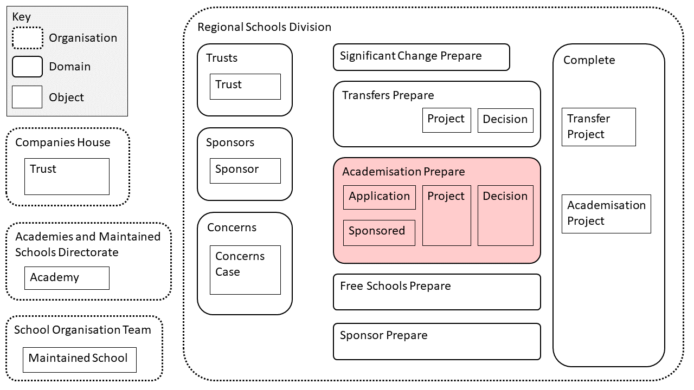
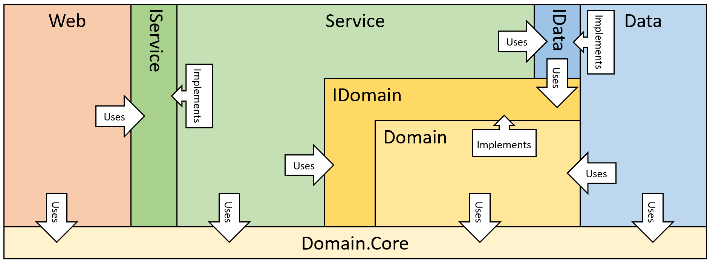

# academisation api
This is the API for persisted data related to academisation:

* Applications to Become an Academy
* Conversion Projects
* Advisory Board Decisions on Conversions

## Context

This API is intended to own the business logic and 
store data related to Preparing for Academisation: the process by which a Maintained School becomes an Academy. This fits within the responsibilities owned by the Regional Services Division:



## Architecture
The architecture of this solution is based on:
* Domain Driven Design
* Hexagon Architecture

The key aspiration of this architecture is to remove any references to technical frameworks (database implementations, web interfaces) from the Domain Layer, so that this layer can focus on the pure logic.  

The following diagram shows the relationship between the projects in the solution:



Each of the layers in this architecture has a distinct set of responsibilities:

| Layer   | Responsibility |
|---------|----------------|
| Web     | Mapping to HTTP |
| Service | Co-ordination of a complete operation |
| Domain  | Validation and Mutation |
| Data    | Persistence |

## Development Setup

### Authentication

When running locally the webapp does not require authentication.  Once deployed the
authentication keys should be provided as a configuration setting.  For best practice
this key should be provided as a UUID:

```
"AuthenticationConfig__ApiKeys__0" -> "<Key>"
"AuthenticationConfig__ApiKeys__1" -> "<Key>"
```

### EntityFramework and Migrations

Set your database connection string in user secrets:

"AcademiesDatabaseConnectionString": "connection string here"

Install the Entity Framework Core CLI Tools:

```
dotnet tool install --global dotnet-ef
```

### Generating migrations

To generate migrations, change to the WebApi directory and run the following command:

```
dotnet ef migrations add <MIGRATION_NAME> --project ..\Dfe.Academies.Academisation.Data\Dfe.Academies.Academisation.Data.csproj --startup-project Dfe.Academies.Academisation.WebApi.csproj --context Dfe.Academies.Academisation.Data.AcademisationContext 
```

OR the following within Visual Studio package manager console with the the 'WebApi' project selected as a startup:-
```
dotnet ef migrations add WantConversionToHappenOnSelectedDate --project Dfe.Academies.Academisation.Data --startup-project Dfe.Academies.Academisation.WebApi --context Dfe.Academies.Academisation.Data.AcademisationContext
```


### Applying migrations
To apply a set of migrations to the database, change to the WebApi directory and run the following command:

```
dotnet ef database update --project ..\Dfe.Academies.Academisation.Data\Dfe.Academies.Academisation.Data.csproj --startup-project Dfe.Academies.Academisation.WebApi.csproj --context Dfe.Academies.Academisation.Data.AcademisationContext
```

OR the following within Visual Studio package manager console with the the 'WebApi' project selected as a startup:-
```
dotnet ef database update --project Dfe.Academies.Academisation.Data --startup-project Dfe.Academies.Academisation.WebApi --context Dfe.Academies.Academisation.Data.AcademisationContext
```


## Getting Started
### Prerequisites
This API uses the TRAMS development SQL Server image.

1) Create a GitHub PAT:
https://docs.github.com/en/authentication/keeping-your-account-and-data-secure/creating-a-personal-access-token

Recommended PAT access:
- `read:packages` (required to pull images from GHCR)
- `repo` (only if your org/repo policy requires it)

2) Set the PAT as an environment variable named `GITHUB_TOKEN`.

PowerShell:
```powershell
$env:GITHUB_TOKEN = "<your-pat>"
```

3) Log in to GHCR:
```bash
docker login https://ghcr.io --username <your-github-username>
```

Use the PAT value as the password when prompted.

4) Start the local stack from the repository root:
```bash
docker compose up --build -d
```

This starts the API and local SQL Server services configured for this repo.

Alternative (database container only):
```bash
docker run -d -p 2401:1433 ghcr.io/dfe-digital/trams-development-database:latest
```

To find the SQL `sa` password configured in the image, inspect the image environment values:
```bash
docker image inspect ghcr.io/dfe-digital/trams-development-database:latest --format "{{json .Config.Env}}"
```

Look for `MSSQL_SA_PASSWORD=...` and use that value in your connection string.

When using the DB-only container on port 2401, the connection string format is:
`Server=localhost,2401;Database=sip;User Id=sa;Password=<MSSQL_SA_PASSWORD>;TrustServerCertificate=True;`

5) Run EF Core migrations

Use the WebApi project as the startup project when running EF commands, otherwise the DbContext cannot be created.

If using the DB-only container on port 2401:
```powershell
$env:AcademiesDatabaseConnectionString="Server=localhost,2401;Database=sip;User Id=sa;Password=<MSSQL_SA_PASSWORD>;TrustServerCertificate=True;"
dotnet ef database update --project Dfe.Academies.Academisation.Data --startup-project Dfe.Academies.Academisation.WebApi --context Dfe.Academies.Academisation.Data.AcademisationContext
```

If using docker compose DB on port 1433:
```powershell
$env:AcademiesDatabaseConnectionString="Server=localhost,1433;Database=sip;User Id=sa;Password=Your_password123;TrustServerCertificate=True;"
dotnet ef database update --project Dfe.Academies.Academisation.Data --startup-project Dfe.Academies.Academisation.WebApi --context Dfe.Academies.Academisation.Data.AcademisationContext
```

No `TramsDataApi` migration commands are required for this repository setup.

## Cypress testing

### Install cypress and dependencies:

Run `npm install` from the CypressTests directory

### Test execution

To run tests through the Cypress runner, run the following:

`npm run cy:open -- --env url="BASE_URL_OF_APP",apiKey="SECRET_HERE"`

To execute the tests in headless mode, run the following (the output will log to the console):

`npm run cy:run -- --env url="BASE_URL_OF_APP",apiKey="SECRET_HERE"`

### Useful tips
#### Linting
We make use of [eslint](https://eslint.org/) for the Cypress tests to ensure code quality. You can explicitly check for issues by running the following from the CypressTests directory:

`npm run lint`

#### Maintaining sessions

Each 'it' block usually runs the test with a clear cache. For our purposes, we may need to maintain the user session to test various scenarios. This can be achieved by adding the following code to your tests:

    afterEach(() => {
		cy.storeSessionData();
	});

#### Writing global commands
The cypress.json file in the support folder contains functions which can be used globally throughout your tests. Below is an example of a custom login command

	Cypress.Commands.add("login",()=> {
		cy.visit(Cypress.env('url')+"/login");
		cy.get("#username").type(Cypress.env('username'));
		cy.get("#password").type(Cypress.env('password')+"{enter}");
		cy.saveLocalStorage();
	})
	
Which you can access in your tests like so:

	before(function () {
		cy.login();
	});
Further details about Cypress can be found here: https://docs.cypress.io/api/table-of-contents

### Code commit comment rules
Nothing formal, but been using the following pattern:

AB#105435 - conversion target date - store whether target date has been chosen - 'description of this commit'

## Linting Sonar rules

Include the following extension in your IDE installation: [SonarQube for IDE](https://marketplace.visualstudio.com/items?itemName=SonarSource.sonarlint-vscode)

Update your [settings.json file](https://code.visualstudio.com/docs/getstarted/settings#_settings-json-file) to include the following

```json
"sonarlint.connectedMode.connections.sonarcloud": [   
    {
        "connectionId": "DfE",
        "organizationKey": "dfe-digital",
        "disableNotifications": false
    }   
]
```

Then follow [these steps](https://youtu.be/m8sAdYCIWhY) to connect to the SonarCloud instance.
